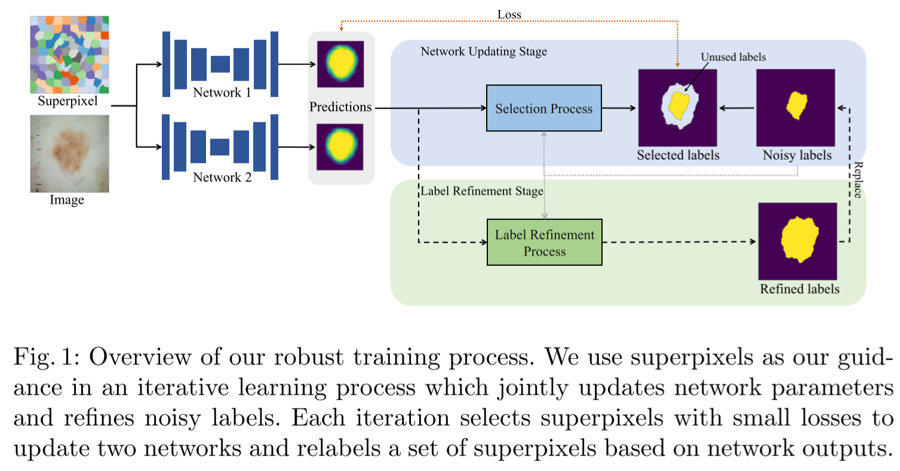

# SP_guided_Noisy_Label_Seg
This repository contains a PyTorch implementation of the MICCAI 2021 paper "[Superpixel-guided Iterative Learning from Noisy Labels for Medical Image Segmentation"](https://miccai2021.org/openaccess/paperlinks/2021/09/01/460-Paper1575.html#author-id).

If you use our code in your publications, please consider citing our paper:
```angular2html
@misc{li2021superpixelguided,
      title={Superpixel-guided Iterative Learning from Noisy Labels for Medical Image Segmentation}, 
      author={Shuailin Li and Zhitong Gao and Xuming He},
      year={2021},
      archivePrefix={arXiv},
}
```



## Get started
### 0. Environment
Install the necessary requirements on your environment of choice:
```angular2html
pip install -r requirements.txt
```

### 1.Download Original Datasets
1. **ISIC 2017 datasets**: Download training data and test data at this [link](https://challenge.isic-archive.com/data/).
2. **JSRT datasets**: Download [image](http://db.jsrt.or.jp/eng.php) and [segmentation masks](https://www.isi.uu.nl/Research/Databases/SCR/).

Note: we suggest you to try the code on ISIC dataset first, then apply on JSRT dataset due to its complicated preprocess procedure.

### 2. Simulate Noise Patterns
Material:
1. data_process/pipeline.py
2. ISIC & JSRT clean data
3. paramters: change params to your directory in __main__()

Function:
1. train/val split  (here val set is used as test set and remain untouched) 
2. noisy label generation
3. convert .png to .json, used as unified input labels.

```angular2html
# change to your parameters first (Params, roots, save_dir)
python pipeline.py
```
### 3. Generate Superpixels
Generate superpixels for input images. 
```angular2html
# change to your parameters first (subdir, Params, ...)
python superpixel_generation.py
```

### 4. Noise ratio statistics
**We assume noise ratios are given following previous works, thus obtain them here.
```angular2html
# change to your parameters first (subdir, cls, Params, ...)
python stat_niose_ratio.py
```

## Training.
```angular2html
python main.py --cfg 'exp/proposed/skin_a3b5_spemj01.yaml' --id skin_a3b5_spemj01 --parallel 
```

## Inference.
```angular2html
python main.py --cfg 'exp/proposed/skin_a3b5_spemj01.yaml' --id skin_a3b5_spemj01 --demo 'val' \
--weight_path './checkpoints/skin_a3b5_spemj01/model_epoch_200.pth' --parallel --save_preds True
```

** Feel free to contact us if confused with above pipeline, and we will make "readme" more clear.